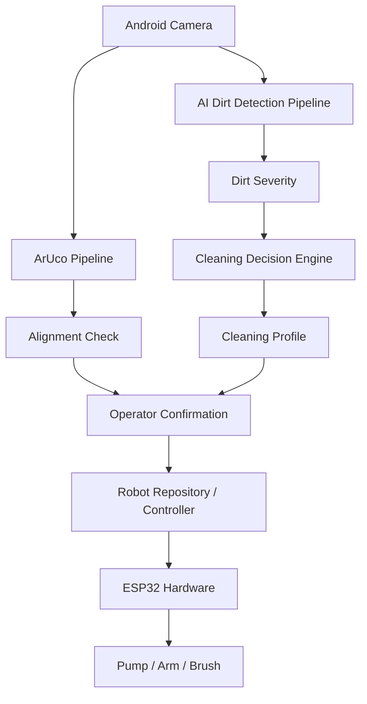

# SmartStall AI Architecture

The SmartStall AI architecture is designed to integrate visual dirt detection into the existing deterministic robotic cleaning system without compromising safety or overriding deterministic hardware control.

## Overview
The Android companion application serves as the primary computational hub. The single Android camera feed is shared between two independent pipelines:
1. **ArUco Vision Pipeline:** Responsible for localization, marker detection, and robotic alignment.
2. **AI Vision Pipeline:** Responsible for dirt detection, severity estimation, and cleaning recommendation.

## Component Breakdown

- **DirtDetectionModel (Abstract):** The interface for AI inference. The initial implementation uses `MockDirtDetectionModel` for development. It will eventually be replaced by a trained TensorFlow Lite or ONNX model.
- **DirtDetectionService:** Consumes frames from the camera and manages inference execution to avoid queueing.
- **CleaningDecisionService:** Converts a `DirtDetectionResult` into a `CleaningProfile`. It determines the required water dosage based on configurable models (e.g., estimating pump duration from desired mL).
- **CleaningController / RobotRepository:** Continues to manage the actual execution of the robot, but now accepts configurable cleaning parameters via `startCleaningWithProfile`.

## Data Flow

