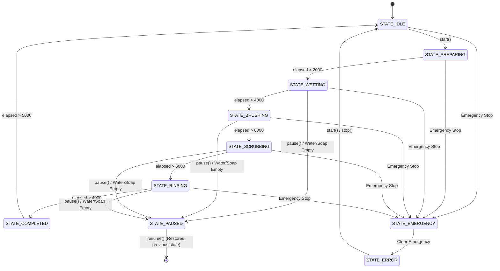

# Cleaning Controller

The `CleaningController` manages the autonomous cleaning state machine. It handles transitions between phases (Wetting, Brushing, Scrubbing, Rinsing) and manages safety interventions.

## State Diagram

## Transition Table

| Current State | Next State | Trigger | Action |
| ------------- | ---------- | ------- | ------ |
| IDLE | PREPARING | `start()` | Initializes timers |
| PREPARING | WETTING | 2000ms elapsed | Starts Water Pump, Motor Forward |
| WETTING | BRUSHING | 4000ms elapsed | Stops Water, Starts Soap & Brush |
| BRUSHING | SCRUBBING | 6000ms elapsed | Stops Soap, Brush continues |
| SCRUBBING | RINSING | 5000ms elapsed | Stops Brush, Starts Water, Motor Backward |
| RINSING | COMPLETED | 4000ms elapsed | Stops Water, increments cycle count |
| COMPLETED | IDLE | 5000ms elapsed | Resets system for next cycle |
| ANY | PAUSED | `pause()` or Low fluid | Stops actuators |
| PAUSED | ANY | `resume()` | Restores previous state |
| ANY | EMERGENCY | E-Stop Button | Stops all actuators immediately |
| ANY | ERROR | Critical Temp | System halts |

## Cleaning Timeline

- **0-2s**: Preparing (Initialization)
- **2-6s**: Wetting (Water applied while moving forward)
- **6-12s**: Brushing (Soap applied, brush spinning, alternating turning)
- **12-17s**: Scrubbing (No soap, deep brush action moving forward)
- **17-21s**: Rinsing (Water applied, moving backward)

## Safety Interrupt Flow

1. `tick()` executes `executeSafetyChecks()` first.
2. Checks `EmergencyController::isEmergency()`. If true, transitions to `STATE_EMERGENCY` and sets abort reason to "Emergency Stop".
3. Checks `SensorManager::getMotorTemp()`. If >= 65.0C, transitions to `STATE_ERROR` and sets abort reason to "Critical Temperature".
4. Checks `SensorManager::getWaterLevel()` and `SensorManager::getSoapLevel()`. If <= 5%, pauses cleaning and sets abort reason to "Water Empty" or "Soap Empty".

## Telemetry Fields

Telemetry engine exports the following related to autonomous cleaning:

- `clean_state`: The current name of the state (e.g. "WETTING").
- `clean_step`: A human-readable step name (e.g. "Spraying Water").
- `clean_progress`: Progress 0-100% based on elapsed time vs total time.
- `clean_remaining`: Estimated time remaining in seconds.
- `clean_elapsed`: Total elapsed time in seconds.
- `clean_cycle`: Number of cleaning cycles completed since boot.
- `abort_reason`: Last reason for a pause or error (e.g. "Emergency Stop", "Water Empty").
