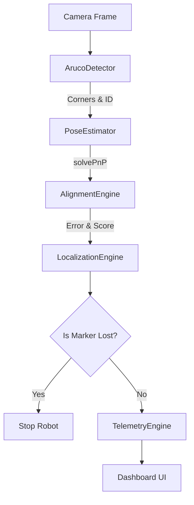

# Localization Pipeline

## State Machine
1. **SEARCHING**: Panning camera or robot body to find marker.
2. **ALIGNMENT_REQUIRED**: Marker detected, but alignment score < 90%.
3. **READY**: Marker is centered, distance is correct, yaw is 0.
4. **LOST**: Safety state triggered if marker disappears for > 2000ms.
