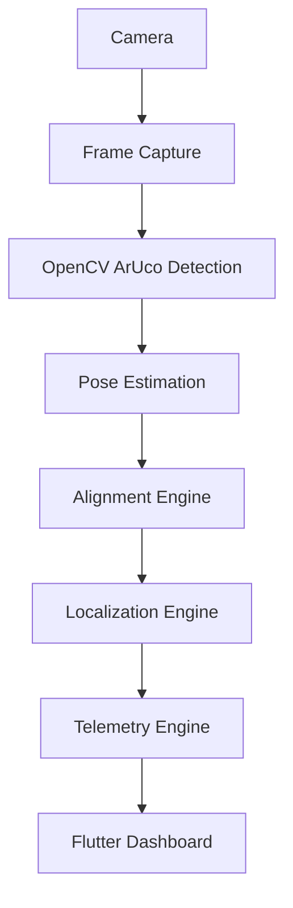

# Vision Architecture

The Vision & Localization subsystem handles precise robot positioning using deterministic computer vision instead of complex AI or SLAM.

## Core Components
- **CameraManager:** Hardware abstraction for camera initialization and frame acquisition.
- **ArucoDetector:** Core OpenCV detection wrapper. Locates ArUco markers and identifies centers/corners.
- **PoseEstimator:** Calculates 3D pose (`cv::solvePnP`) to determine translation and rotation.
- **AlignmentEngine:** Translates 3D pose into actionable robot offsets.
- **LocalizationEngine:** High-level state machine tying all vision logic together and feeding the `CleaningController`.

## Data Flow

