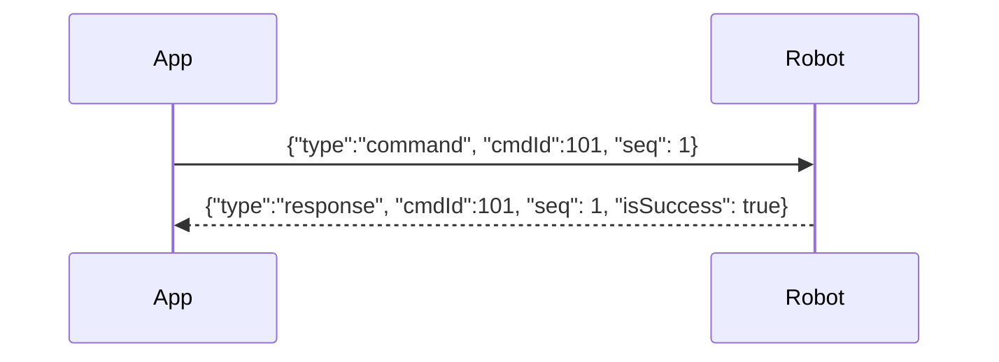
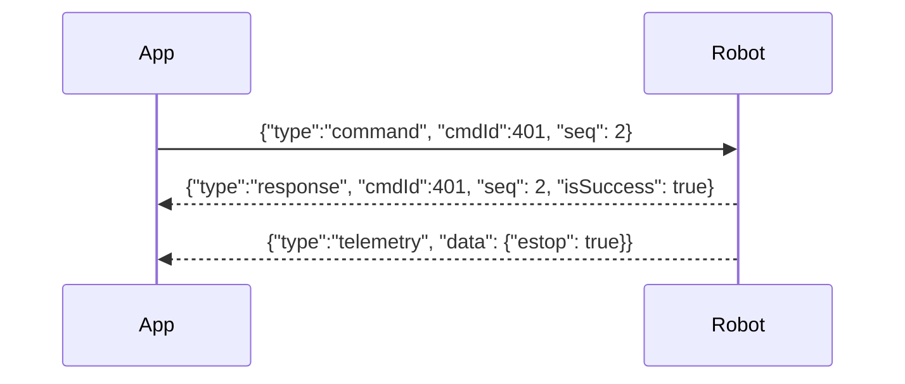

# Sequence Diagrams

## Standard Command Flow

```mermaid
sequenceDiagram
    participant App
    participant Robot
    App->>Robot: {"type":"command", "cmdId":101, "seq": 1}
    Robot-->>App: {"type":"response", "cmdId":101, "seq": 1, "isSuccess": true}
```

## Emergency Stop Flow

```mermaid
sequenceDiagram
    participant App
    participant Robot
    App->>Robot: {"type":"command", "cmdId":401, "seq": 2}
    Robot-->>App: {"type":"response", "cmdId":401, "seq": 2, "isSuccess": true}
    Robot-->>App: {"type":"telemetry", "data": {"estop": true}}
```
